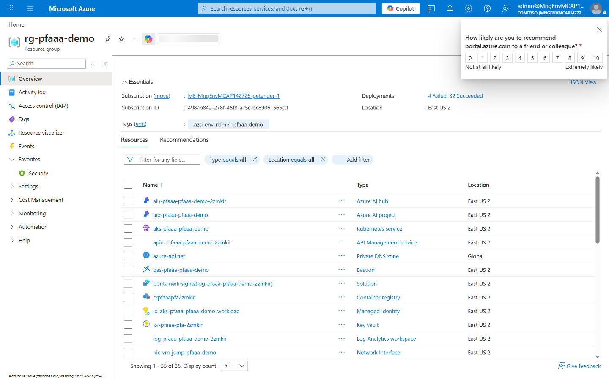
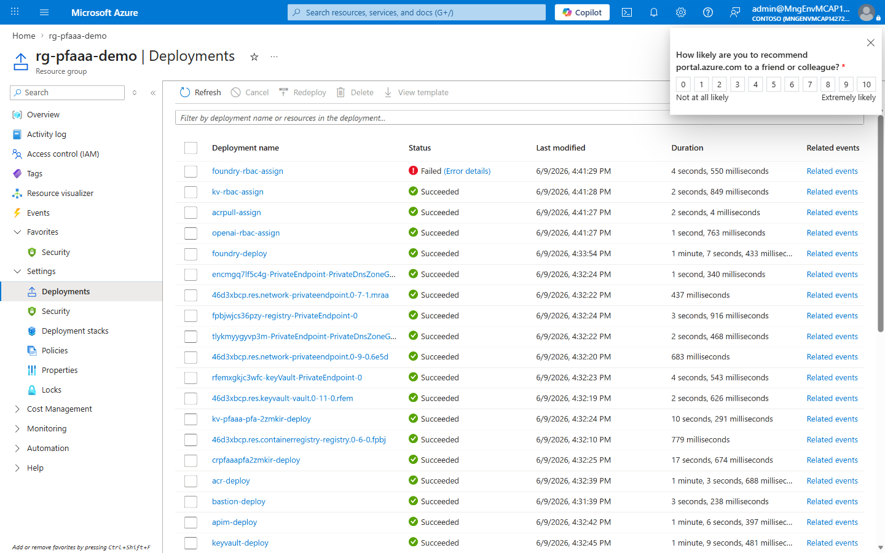
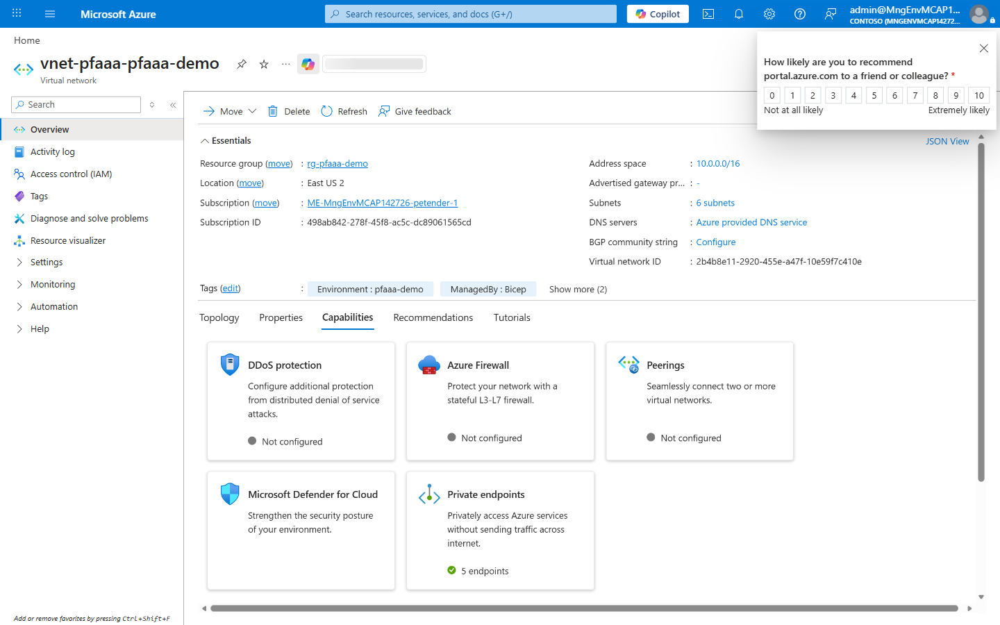
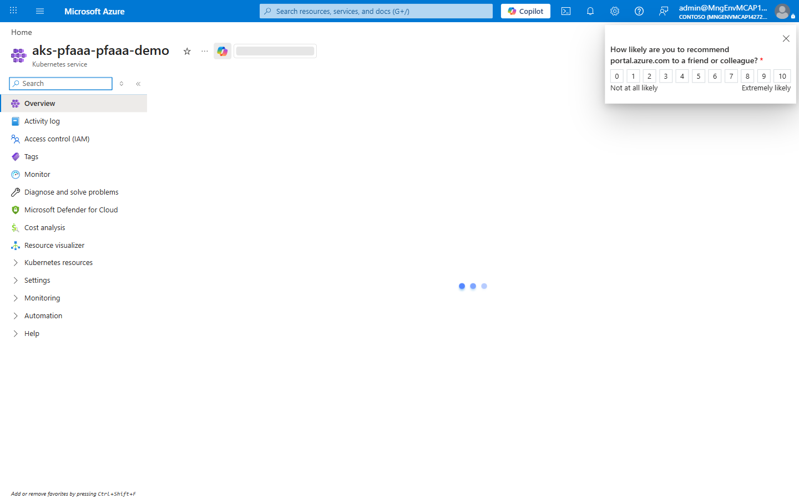
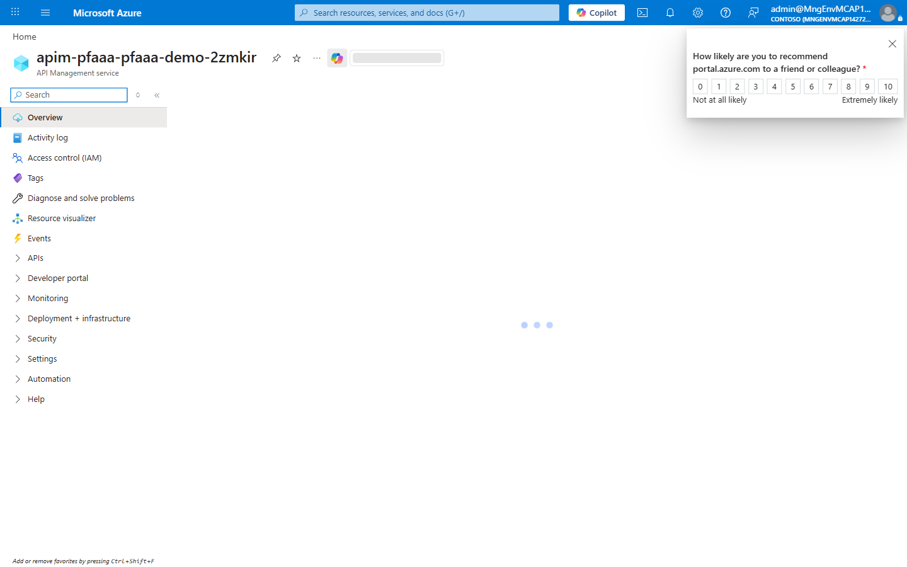
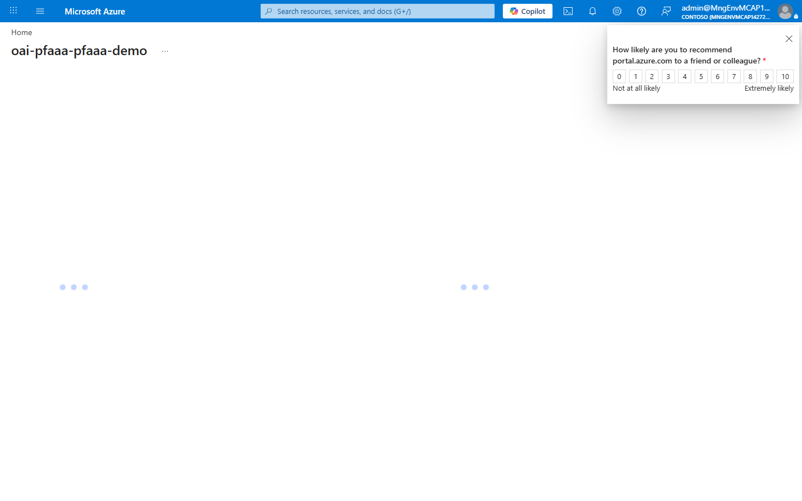

# Demo Guide - private-foundry-aks-apim-afd

📑 Demo Guide Contents

---

### private-foundry-aks-apim-afd - demo scenario

**Note:** Below demo steps should be used **as a guideline** for doing your own demos.

---

### 1. What Resources are getting deployed

This scenario demonstrates progressive hardening from internal AKS access to Front Door plus private APIM.
The deployed stack includes private AKS, APIM, jump VM and Bastion, private AI Foundry/OpenAI, and ACR/Key Vault.

- rg-pfaaa-demo - Azure Resource Group.
- aks-pfaaa-pfaaa-demo - private AKS cluster.
- apim-pfaaa-pfaaa-demo-2zmkir - API Management.
- vm-jump-pfaaa-demo and bas-pfaaa-pfaaa-demo - private admin access path.
- aih-pfaaa-pfaaa-demo-2zmkir and aip-pfaaa-pfaaa-demo - Foundry hub/project.
- oai-pfaaa-pfaaa-demo with private endpoint pe-oai-pfaaa-pfaaa-demo.
- crpfaaapfa2zmkir and kv-pfaaa-pfa-2zmkir with private endpoints.

  

  

  

  

### 2. What can I demo from this scenario after deployment

Pre-demo checklist:

- PASS: `az group show --name rg-pfaaa-demo --output table`
- PASS: `az aks show --name aks-pfaaa-pfaaa-demo --resource-group rg-pfaaa-demo --query provisioningState -o tsv`
- PASS: `az apim show --name apim-pfaaa-pfaaa-demo-2zmkir --resource-group rg-pfaaa-demo --query provisioningState -o tsv`
- PASS: `az vm show --name vm-jump-pfaaa-demo --resource-group rg-pfaaa-demo --query provisioningState -o tsv`

Demo flow (Technical, 30 minutes):

1. (4 min) Show RG and explain stage-based security progression.
2. (5 min) Show VNet/subnets, private endpoints, and NSG posture.
3. (5 min) Show private AKS and workload identity pattern.
4. (5 min) Show APIM external vs internal mode architecture.
5. (5 min) Show Foundry/OpenAI private connectivity and project wiring.
6. (3 min) Show Bastion + jump VM operational access model.
7. (3 min) Show monitoring workspace and key diagnostics entry points.

Contingency playbook:

- AKS service path unavailable:
  - Diagnose: `az aks command invoke -g rg-pfaaa-demo -n aks-pfaaa-pfaaa-demo -c "kubectl get pods,svc -A"`
  - Recover: restart failing deployment or service.
- APIM routing failure:
  - Diagnose: backend/health and APIM trace.
  - Recover: validate backend target and policy settings.
- Foundry/OpenAI private endpoint issue:
  - Diagnose: PE provisioning state and private DNS links.
  - Recover: verify DNS zone link and PE connection approval.

  

  

---

